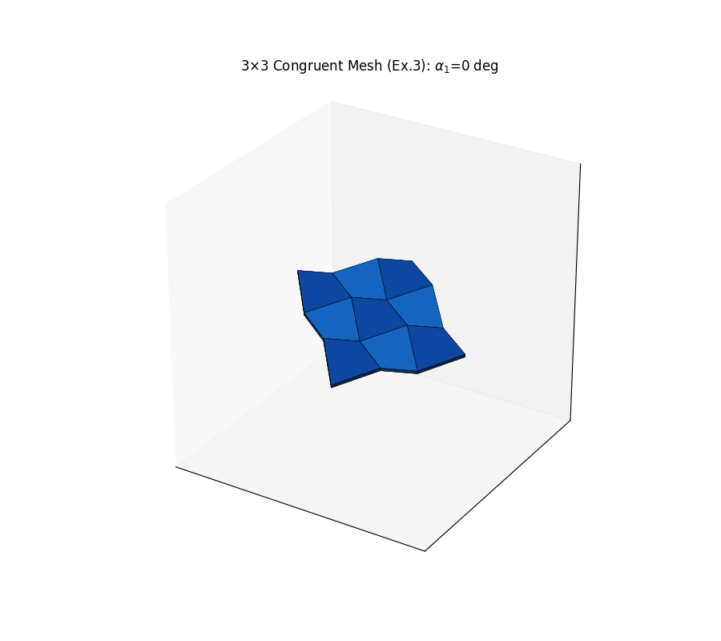

# Clipping-papers

刚性折纸（rigid origami）实验代码：复现论文 **《Flexible quadrilateral mesh of isogonal type in arbitrary size》** —— Yang Liu, Jinsan Cheng, *ACM Transactions on Graphics* 37(4), Article 111, 2018（SIGGRAPH 2018）。

## 演示

3×3 等角网格（9 个面全等，论文 Example 3 全等情形）沿 Bricard 分支折叠再展开：



## 原理简介

- **等角网格（isogonal mesh）**：每个顶点周围 4 个扇形角固定；**反等角条件** λ′ᵢ + μ′ᵢ = γ′ᵢ + δ′ᵢ = π。
- 二面角 αᵢ 满足 **Bricard 方程**：(kᵢxᵢ − xᵢ₊₁)(kᵢ′xᵢ − xᵢ₊₁) = 0，其中 xᵢ = tan(αᵢ/2)，
  kᵢ = (sin γ′ᵢ − sin λ′ᵢ) / sin(γ′ᵢ − λ′ᵢ)。
- **Example 3（全等情形）**：λ′₁ = 75°，λ′₂ = 60° ⇒ λ′₃ = 105°，λ′₄ = 120°，γ′ᵢ = λ′ᵢ₋₁；
  9 个面全等于同一个圆内接四边形 Q（边长 1.983 / 1.218 / 1.218 / 0.765，内角 75° / 60° / 105° / 120°）。
- **折叠路径**：分支 k₁K₂k₃K₄ = 1，α₁ 由 0 驱动到 178° 再展开；方向为上侧 T 朝下叠、下侧 B 朝上叠、左 / 右朝下叠。
- **共边贴合**：角面每帧用三点刚性配准跟随相邻两个边中面，12 条共边及全部角点在折叠全程精确贴合（间隙 ~1e-16，机器精度）。

## 文件

| 文件 | 说明 |
|---|---|
| `origami_grid3x3.py` | 主程序：3×3 网格（9 面全等）折叠动画 → `origami_grid3x3.gif` |
| `origami_grid2x2.py` | 2×2 版本：4 块全等圆内接四边形，度 4 顶点刚性折叠 |
| `check_congruent.py` | 2×2 面板全等性与折叠全程刚性校验脚本 |
| `origami_folding.py` | 手风琴式折叠演示（太阳翼样式） |
| `clipping paper.py` | 通用四边形网格折叠动画渲染模板 |
| `ToG.pdf` | 原论文 |
| `*.gif` | 各版本的折叠动画输出 |

## 运行

```bash
pip install numpy scipy matplotlib
python origami_grid3x3.py     # 生成 origami_grid3x3.gif
```

## 参考

Y. Liu, J. Cheng. Flexible quadrilateral mesh of isogonal type in arbitrary size. *ACM Trans. Graph.* 37(4), Article 111, 2018.
